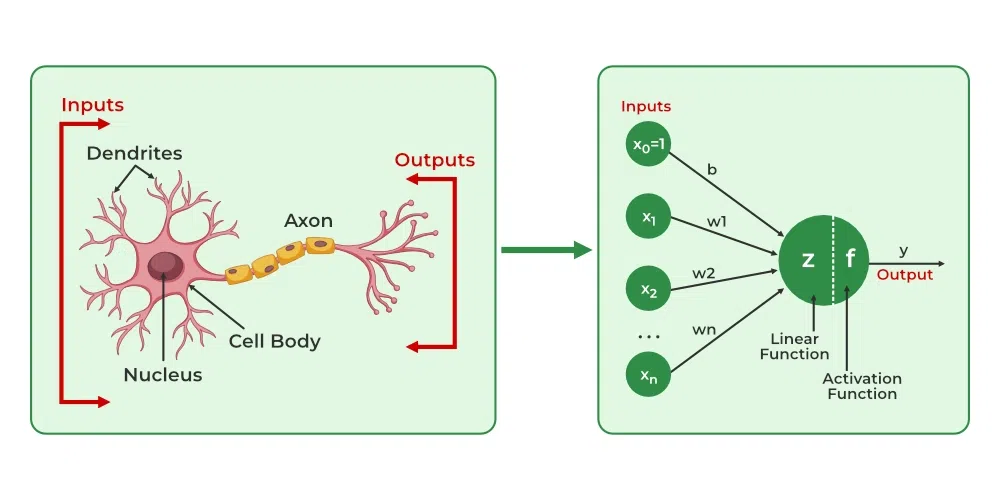

# Artificial Neural Network

ANN consist of primary building blocks known as **units**.
These units are arranged in a series of layers which form the ANN.

Number of units in a layer can vary from a dozen to millions depending upon the complexity of the data set at hand.

Generally ANN consist of an input layer, some hidden layers in between and an output layer.

Input layer receives the data from the outside, the hidden layer parse the data and make it valuable for the output layer. Then the output layer finally gives the output.

In majority of the neural networks units are connected from one layer to another. These connections have **weights** associated with them which determine the influence of the unit.

The input layer of the neural network is the first layer it takes in data from the external world and passes it to the 2nd layer which is the hidden layer. While passing data from one layer to another layer a weighted sum is calculated which is sent to next layer.

This means we can optimize the neural network by tweaking the weights, to steer the outcome towards the desired output.

# Biological Neurons VS Artificial Neurons

## Structure

| Biological        | Artificial |
| ----------------- | ---------- |
| Dendrite          | input      |
| cell nucleus/Soma | Nodes      |
| Axon              | Output     |
| synapses          | weights    |

## Learning

In biological neurons the learning happens in the cell nucleus. The cell nucleus processes the incoming impulses and determines whether to produce an action potential which will travel through the axon.

**Synaptic plasticity**: It represents the ability of a synapse to become weaker or stronger over time in response to the change in their activity. In ANN we use back propagation to update/correct the weights in response to the difference between the calculated and the actual outcome.

## Activation

In biological neurons the activation is the firing rate of the impulses from a neuron which totally depends on if the input signals are of a certain threshold or not.
Meanwhile in ANN there are activation functions which take in the input from the previous layer and perform a computation with them and the output of this function is compared against a threshold to decide whether the current unit is activated or not.

# How ANN Learn

- Start with some initial weights
- Calculate error and update using back propagation.
- repeat this until error is minimized.

# Types of Neural Networks

1. Feed forward neural network: Feed forward neural networks are most basic kind of neural networks. In feedforward neural networks the data enters the network in the input layer and it flows through the hidden layers and finally gives an output in the output layer. There is only one wave of front propagation of the data. Ususally they don't have a weight updating mechanism like back propagation.

2. Convolutional neural network: Very similar to feed forward neural network. But they have special layers to process data known as convolutional layers. These layers perform a convolution operation on the input layer and passes it to the next layer. These types of networks find their application in speech/image recognition and computer vision.

3. Recurrent neural network: Recurrent neural networks have their first layer similar to the feed forward neural network but it becomes different after the computation of output of the first layer. They are separated by their "memory" which means that the current inputs and outputs are affected by the previous inputs. Work well on sequential and time series data.

# Applications

1. Social Media
2. Marketing and Sales
3. Healthcare
4. Personal Assistant
