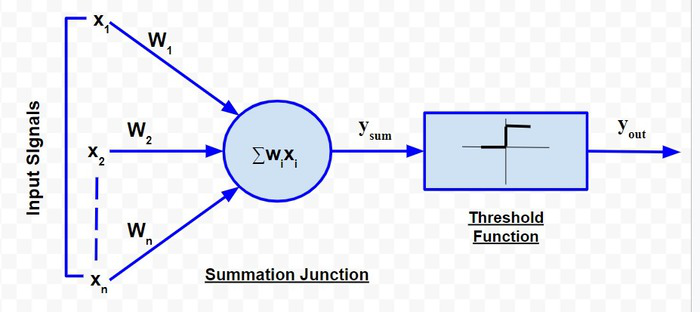
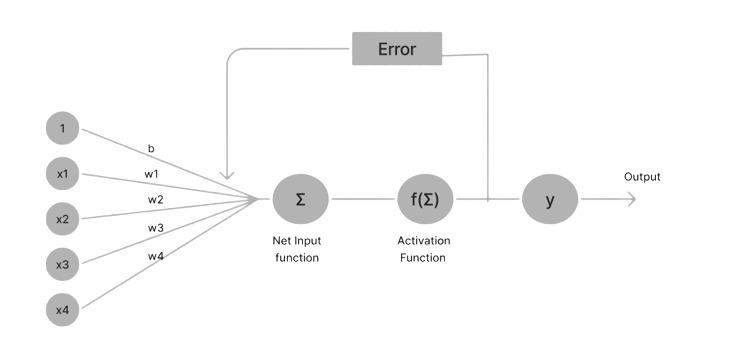

# Types of Models

## 1. Mc Culloch - Pitts model

Earliest ANN model
It has only two types of inputs: excitatory and inhibitory. Former is represented using positive weights while the later is represented using negative weights. The input in only in the form of 0 and 1. The output is decided by comparing the weighted sum of the inputs and weights with a threshold. Which means Y is 1 if the y_sum >= threshold else Y is 0.

Example: Let's take a scenario Aman carries an umbrella if it is raining or if it is sunny.

There are 4 cases here.

1. It rains and it is sunny
2. It rains but not sunny
3. It doesn't rain but it is sunny
4. It doesn't rain and it is not sunny.

Let's define two inputs X1 and X2
where
X1: It rains
X2: It is sunny

| X1  | X2  | Sum | Output |
| --- | --- | --- | ------ |
| 1   | 1   | 2   | 1      |
| 1   | 0   | 1   | 1      |
| 0   | 1   | 1   | 1      |
| 0   | 0   | 0   | 0      |

As we can see that we need a threshold of 1 to determine the outcome.

## 2. Perceptron Model

It is a single layer feed forward model introduced in the late 1950s by Frank Rosenblatt. It was the starting of **Deep Learning** and **ANN**.

Perceptron consists of a single layer of input nodes which is fully connected to the output layer. It can learn linearly separable patterns. It uses slightly different types of artificial neurons known as TLU (threshold logic units) which are similar to the McCulloch and Pitt model.

## Types of Perceptron

1. Single layer perceptron: Contains only two layers one for input and the other for output. Primarily utilized for classification tasks, It is effective on data which can be separated linearly. It is suited for simple classification tasks.

2. Multilayer Perceptron: They contain more than 2 layers and are used to handle more complex data. They can process and find relations in a complex dataset.

## Components of a perceptron

1. Input features
2. Bias
3. Weights
4. Output
5. Activation function: Uses Heaviside activation function (which fancy name for comparing with threshold)
6. Learning algorithm(Weight Update Rule): Updates weights and bias using the difference between actual and expected output.
7. Summation function: Weighted sum

## Steps

1. Assign initial weights to all nodes
2. Start from input nodes, and calculate output of the layer using weighted sum.
   z = w1.x1 + w2.x2 + w3.x3 .... wn.xn = Xt@W

h(z) = {0, 1} Depending upon the threshold

3. Then weights are updated using this update rule

w_new = w - n _ (ya - yo) _ xi for every node

# Adaptive Linear Neural Network (Adaline)

An unit with a linear activation function is called as a **Linear model**. A neural network with one linear unit is known as an **Adaline** network. There is only one output unit and it's value is bipolar (-1, 1).
The weights are adjustable. It uses the delta rule.

w_new = w - (yo - ya) \* xi

**NOTE: No learning rate**

