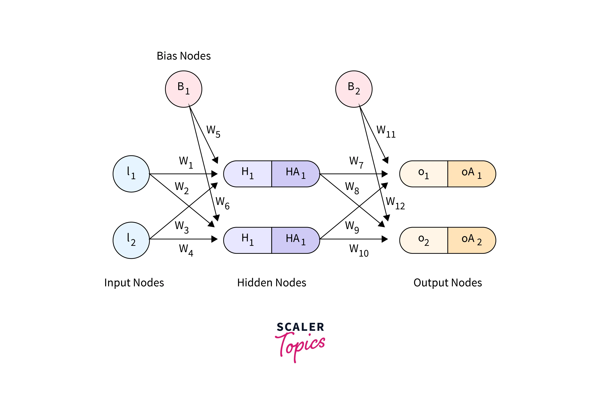

# Feedforward Network

- One of the simplest types of ANN. Information moves in only one direction that is from input to output nodes through the hidden layers.

## Architecture

The units inside layers are called as neurons. The neurons in one layer are connected to the other layer using weights. The consist of 3 types of layers:

### 1. Input layer

This layer takes in the data, the shape of this layer depends on the shape of the data. There is onen input layer
in Feedforward Network

### 2. Hidden layer

The hidden layer can take input from input/hidden layer and then they parse the data and pass it through **activation function**,
Hidden layers perform the computations in a neural network. There can be 0+ hidden layers in a Feedforward network

### 3. Output layer

The output layer is the last layer in a neural network which is used to represnt the output generated by the neural
network, the shape of this layer depends on the number of outcomes of the neural network and the activation
function is chosen accordingly.

